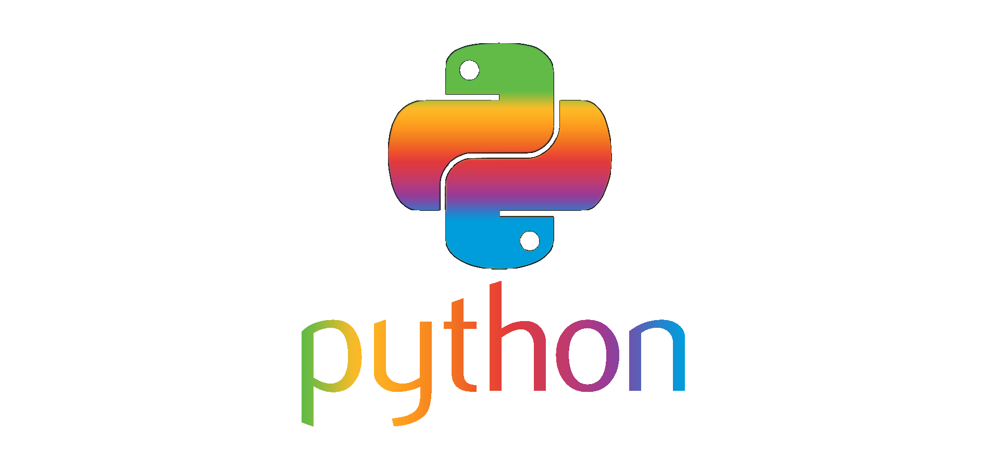

# everLASTing games for EnergyHack2022

## Plan-kapkan
1.
    * Перевести [парсер команд](https://github.com/Foresteam/cmd-argparse) на Phyton.
      ### Status: ✓
    * Написать каркас бота. Он должен уметь отличать групповые диалоги(сервера) от ЛС, отправлять вложения. Для группы будет 1 тест на канал, а в ЛС - персональный. [нужен объект Message]
      ### Status: ✓
2.
    * Реализовать интерфейс диалога, API самого теста.
      ### Status: ✓ (still testing)
    * Импорт теста, XML описание.
      ### Status: ✓
    * Придумать и сделать систему баллов, уровней.
      ### Status: ✓
    * Продумать админ панель. (админские команды, кому они доступны)
      ### Status: ...
3.
    * Заполнить бота вопросами и ответами.
      ### Status: ...
    * Научить робота показывать рейтинг (всех игроков in total, игроков на конкретных уровнях). Быть может сделать еще какие-то фильтры (**работа с БД**). Вероятно, будет экспорт таблиц в CSV. Можно сделать экспорт в виде скриншота части таблицы, если останется время.
      ### Status: ...